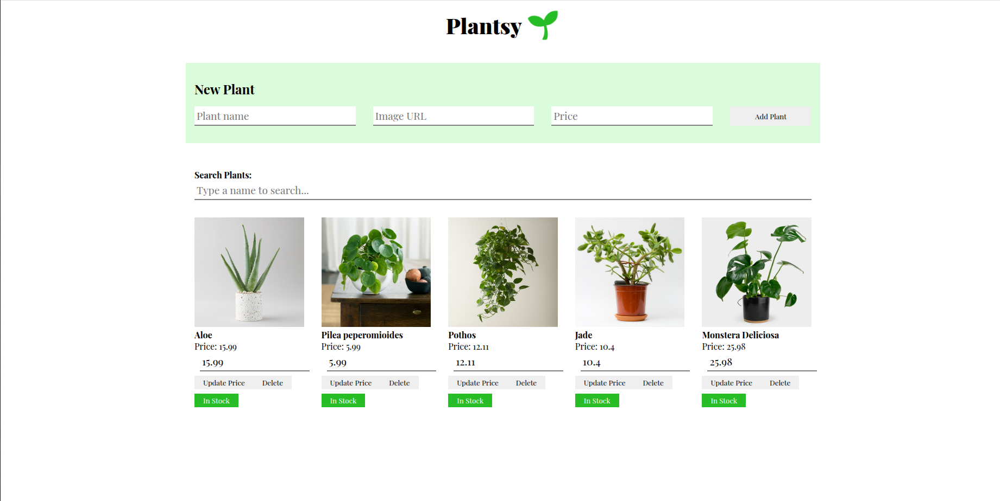

# 🌿 PlantSy App



A React application for managing an online plant store inventory.

## Features

- 🪴 View all available plants
- ➕ Add new plants to inventory
- ✏️ Update plant prices (persists after refresh)
- ❌ Delete plants from store
- 🔍 Search plants by name
- 📱 Fully responsive design

## 🛠️ Setup

1. Install dependencies:
```bash
npm install
Start the JSON server (port 6001):

bash
npm run server
Start the React app (port 3000):

bash
npm start
Verify backend is running:

http://localhost:6001/plants

📡 API Endpoints
Base URL
http://localhost:6001

Core Endpoints
Method	Endpoint	Description
GET	/plants	Get all plants
POST	/plants	Add new plant
Advanced Endpoints
Method	Endpoint	Description
PATCH	/plants/:id	Update plant price
DELETE	/plants/:id	Delete plant


💻 Technologies Used
Frontend
React (Functional Components)

React Hooks (useState, useEffect)

CSS3 (Flexbox/Grid)

Backend
JSON Server (Mock REST API)

Development
Create React App

npm

Git


